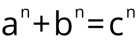

Программа считывает описание математической формулы
и сохраняет файл `.png` с изображением этой формулы.

### Текст задания
Считывать с клавиатуры формулу, как она записывается в программировании
(например, в паскале) и писать на диск файл с картинкой этой формулы
(например, в формате несжатый BMP).
Вы должны поддерживать операции сравнения,
арифметические операции (деление при помощи дроби),
степень (во входной формуле — операция ^),
индексы (во входной формуле задаются при помощи квадратных скобок),
суммы (задаются как sum(нижний предел, верхний, слагаемое)),
аналогично произведения и интегралы,
наборы вариантов cases(первый вариант, его условие,
второй вариант, его условие, ...)
(так они выглядят во входной формуле,
в результате — формулы с большой фигурной скобкой спереди),
матрицы (во входной формуле
matrix([первая строка как список элементов], [вторая], ...).
Размеры всех видов скобок должны
автоматически увеличиваться по мере необходимости.

### Пример
Ввод:
```
a^n + b^n = c^n
```
Вывод:



### Сборка и запуск
Склонируйте репозиторий и соберите проект с помощью cmake,
после чего запустите программу `formula_drawer`.
